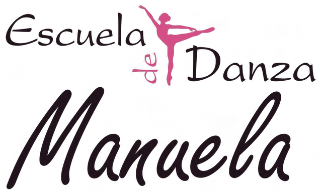
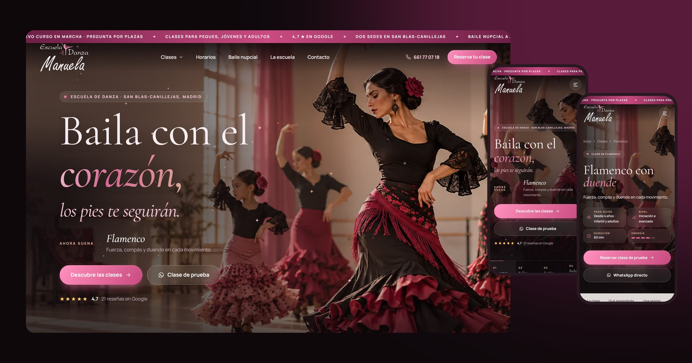

<p align="center">
  
</p>

<p align="center"><em>«Baila con el corazón, los pies te seguirán»</em></p>

<p align="center">
  <a href="https://sefiro888.github.io/escueladanzamanuela/"><strong>Ver la web en directo →</strong></a>
</p>



Web de demostración para la **Escuela de Danza Manuela**, escuela de baile familiar en San Blas-Canillejas (Madrid), con sedes en **Av. de Canillejas a Vicálvaro, 139** y **C/ Longares, 48**.

> Es una **web de demostración**: está marcada con `noindex`, el horario es orientativo y las fotografías son ilustrativas.

## Lo más destacado

- **Identidad «Noir Rosé»**: noche ciruela, el rosa del logotipo, oro rosa y porcelana. Tipografías Cormorant Garamond (titulares) y Manrope (texto).
- **Logotipo recuperado** con fondo transparente (letras blancas y bailarina rosa) a partir del original, más favicon e iconos de app con la bailarina.
- **Banner principal en movimiento**: pase de los 9 estilos con efecto Ken Burns, destellos animados, carril de estilos con progreso y «Ahora suena…» sincronizado.
- **Cinta doble de estilos** en movimiento y barra superior de avisos animada.
- **Mega menú** en escritorio con vista previa de cada clase al pasar el ratón, y **menú móvil a pantalla completa** con mosaico de clases, además de barra de acciones fija (Clases · Horarios · WhatsApp · Llamar · Sedes).
- **10 páginas de disciplina** (flamenco, ballet, funky, baile moderno, comercial, K-pop, salsa y salón, zumba, country y baile nupcial), cada una con: datos rápidos y medidor de energía, descripción, qué aprenderás, cómo es una sesión, para quién es, qué llevar, niveles, horario propio, opinión real, preguntas frecuentes, **reserva por WhatsApp con mensaje redactado** y carrusel de otros estilos.
- **Test «¿Qué estilo va contigo?»**, filtro de clases por edad y energía, horario semanal con «Hoy» y «Próxima clase», galería con visor, opiniones reales de Google en carrusel, FAQ y mapas que solo se cargan si se pulsan.
- Intro animada (una vez por sesión), transición entre páginas, cursor personalizado y botones magnéticos. Todo respeta «reducir movimiento».

## Datos reales utilizados

- Teléfono y WhatsApp **661 77 07 18**, correo **escueladedanzamanuela@gmail.com**, Instagram [@escueladedanzamanuela](https://www.instagram.com/escueladedanzamanuela/) y [Facebook](https://www.facebook.com/p/Escuela-de-Danza-Manuela-100031771106340/).
- Valoración **4,7 ★ con 21 reseñas en Google**; las reseñas se citan literalmente.
- Grupos **Liryc** y **Blackfunk**, segundos de su categoría en el Campeonato de España; participación en el certamen *Bailando a la Vida*.

## Pendiente de confirmar con la escuela

- Horario real de grupos (`SCHEDULE` en `scripts/content.mjs`) y precios.
- Que el 661 77 07 18 tenga WhatsApp (todas las reservas lo usan).
- Datos del titular para los textos legales (marcados como «Pendiente»).
- Fotografías reales de las clases para sustituir las ilustrativas.

## Estructura y edición

| Ruta | Contenido |
| --- | --- |
| `scripts/content.mjs` | **Todos los textos y datos**: clases, reseñas, horario, FAQ, test… |
| `scripts/build.mjs` | Plantillas: genera las 18 páginas HTML |
| `assets/css/site.css` · `assets/js/main.js` | Estilos e interacciones |
| `scripts/prepare_assets.py` | Genera `assets/img/` (WebP, logo transparente, iconos, imagen para compartir) desde `fuentes/` |
| `fuentes/` | Imágenes originales en PNG |

```bash
node scripts/build.mjs          # regenera las páginas tras editar content.mjs
node scripts/serve.mjs 5210     # servidor local en http://localhost:5210
node scripts/check.mjs          # comprueba enlaces e imágenes
python scripts/prepare_assets.py
```

No edites los `.html` a mano: se sobrescriben al ejecutar el build.
